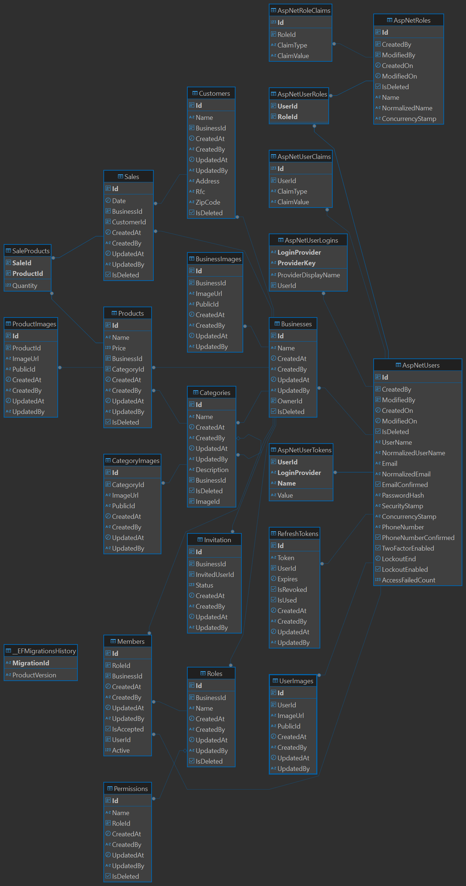

# 📋 Aplicación de Gestión Ligera y Flexible — *GestionaT*

Una **aplicación ligera, flexible y escalable**, diseñada para ayudar a pequeños negocios —como tiendas de abarrotes, puestos de comida, estéticas y otros comercios locales— a **gestionar sus operaciones, aumentar sus ventas y digitalizar su administración diaria** con facilidad.

---

## ✨ Funciones principales actuales

- 📦 **Control de inventario** y gestión de existencias  
- 🏷️ **Administración de productos**, precios y costos  
- 🧾 **Registro de ventas** y generación de reportes diarios en PDF  
- 👥 **Gestión de usuarios** y autenticación con:
  - 🔐 **JWT + Refresh Token**
  - 🌐 **OAuth** (Google, Facebook)
- 📤 **Carga de imágenes** con conexión a **CDN (Cloudinary)**
- 📈 **Reportes detallados de ventas en PDF**
- 🔐 Seguridad basada en **ASP.NET Core Identity + JWT**
- 🚀 Listo para despliegue en servicios gratuitos (free-tier)

---

## 🛠️ Construida con

- 🧱 **Clean Architecture** (Arquitectura limpia)  
- 🖥️ Backend en **ASP.NET Core**  
- 🗃️ **PostgreSQL** como base de datos relacional  
- ⚡ **Redis** para almacenamiento en caché  
- ☁️ **Cloudinary** para manejo de imágenes y recursos multimedia  

---

## 🧩 Próximamente / En desarrollo

- 🛒 **Plataforma de pedidos en línea**: Los usuarios podrán **ordenar productos a negocios certificados** directamente desde la app.  
- 📍 **Catálogo abierto de negocios cercanos**: Solo los negocios que hayan pasado por un proceso de **certificación** aparecerán listados.  
- 💵 **Modelo de venta directa con pago en efectivo**: El usuario paga al recibir el pedido.  
- 🚚 **Logística libre**: Cada negocio maneja sus propios envíos. Una vez entregado el producto, podrá **marcar la orden como completada**.  
- 🧭 **Geolocalización**: Los usuarios verán **negocios cercanos** para facilitar entregas locales rápidas.  

---

## 🎯 Ideal para

- Emprendedores  
- Micronegocios y comercios locales  
- Profesionales independientes  
- Tiendas físicas que desean digitalizar su operación sin complicaciones técnicas

---

## 📌 Visión del proyecto

**GestionaT** busca convertirse en una solución todo-en-uno que permita a los negocios tradicionales:

- Digitalizar sus procesos de forma sencilla  
- Vender sin intermediarios ni comisiones  
- Ofrecer atención personalizada y directa  
- Ampliar su alcance local con herramientas modernas

---

## 📊 Diagrama de base de datos

